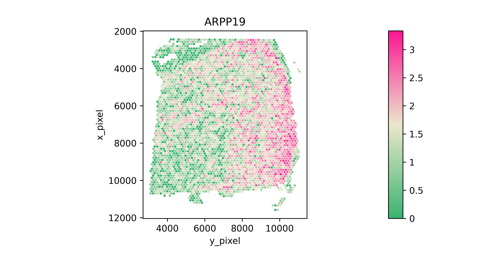

<h1><center>SpaGCN Tutorial</center></h1>


<center>Author: Jian Hu*, Xiangjie Li, Kyle Coleman, Amelia Schroeder, Nan Ma, David J. Irwin, Edward B. Lee, Russell T. Shinohara, Mingyao Li*

## Outline
- 0. Installation
- 1. Import modules
- 2. Read in data
- 3.


### 0. Installation
The installation should take a few minutes on a normal computer. To install SpaGCN package you must make sure that your python version is over 3.5. If you don’t know the version of python you can check it by:


```python
import platform
platform.python_version()
```


    '3.8.8'


Note: Because SpaGCN pends on pytorch, you should make sure torch is correctly installed.
<br>
Now you can install the current release of SpaGCN by the following three ways:
#### 0.1 PyPI: Directly install the package from PyPI.


```python
"""
pip3 install SpaGCN
#Note: you need to make sure that the pip is for python3，or you can install SpaGCN by
python3 -m pip install SpaGCN
#If you do not have permission (when you get a permission denied error), you can install SpaGCN by
pip3 install --user SpaGCN
"""
```
#### 0.2 Github
Download the package from Github and install it locally:


```python
"""
git clone https://github.com/jianhuupenn/SpaGCN
cd SpaGCN/SpaGCN_package/
python3 setup.py install --user
"""
```

#### 0.3 Anaconda
If you do not have Python3.5 or Python3.6 installed, consider installing Anaconda (see Installing Anaconda). After installing Anaconda, you can create a new environment, for example, SpaGCN (you can change to any name you like).


```python
"""
#create an environment called SpaGCN
conda create -n SpaGCN python=3.7.9
#activate your environment 
conda activate SpaGCN
git clone https://github.com/jianhuupenn/SpaGCN
cd SpaGCN/SpaGCN_package/
python3 setup.py build
python3 setup.py install
conda deactivate
"""
```

### 1. Import modules

```python
import os,csv,re
import pandas as pd
import numpy as np
import scanpy as sc
import math
import SpaGCN as spg
from scipy.sparse import issparse
import random, torch
import warnings
warnings.filterwarnings("ignore")
import matplotlib.colors as clr
import matplotlib.pyplot as plt
import SpaGCN as spg
#In order to read in image data, we need to install some package. Here we recommend package "opencv"
#inatll opencv in python
#!pip3 install opencv-python
import cv2
```


```python
spg.__version__
```


    '1.1.0'


### 2. Read in data
The current version of SpaGCN requres three input data.
<br>
1.The gene expression matrix(n by k): expression_matrix.h5;
<br>
2. Spatial coordinateds of samplespositions.txt;
<br>
3. Histology image(optional): histology.tif, can be tif or png or jepg.
<br>
The gene expreesion data can be stored as an AnnData object. AnnData stores a data matrix .X together with annotations of observations .obs, variables .var and unstructured annotations .uns. 


```python
"""
#Read original data and save it to h5ad
from scanpy import read_10x_h5
adata = read_10x_h5("../tutorial/data/expression_matrix.h5")
spatial=pd.read_csv("../tutorial/data/positions.txt",sep=",",header=None,na_filter=False,index_col=0) 
adata.obs["x1"]=spatial[1]
adata.obs["x2"]=spatial[2]
adata.obs["x3"]=spatial[3]
adata.obs["x4"]=spatial[4]
adata.obs["x5"]=spatial[5]
#Select captured samples
adata=adata[adata.obs["x1"]==1]
adata.var_names=[i.upper() for i in list(adata.var_names)]
adata.var["genename"]=adata.var.index.astype("str")
adata.write_h5ad("../tutorial/data/sample_data.h5ad")
"""
#Read in gene expression and spatial location
adata=sc.read("../tutorial/data/sample_data.h5ad")
#Read in hitology image
img=cv2.imread("../tutorial/data/histology.tif")
```

### 3. Integrate gene expression and histology into a Graph


```python
#Set coordinates
adata.obs["x_array"]=adata.obs["x2"]
adata.obs["y_array"]=adata.obs["x3"]
adata.obs["x_pixel"]=adata.obs["x4"]
adata.obs["y_pixel"]=adata.obs["x5"]
x_array=adata.obs["x_array"].tolist()
y_array=adata.obs["y_array"].tolist()
x_pixel=adata.obs["x_pixel"].tolist()
y_pixel=adata.obs["y_pixel"].tolist()

#Test coordinates on the image
img_new=img.copy()
for i in range(len(x_pixel)):
    x=x_pixel[i]
    y=y_pixel[i]
    img_new[int(x-20):int(x+20), int(y-20):int(y+20),:]=0

cv2.imwrite('./sample_results/151673_map.jpg', img_new)
```

The ‘s’ parameter determines the weight given to histology when calculating Euclidean distance between every two spots. ‘s = 1’ means that the histology pixel intensity value has the same scale variance as the (x,y) coordinates, whereas higher value of ‘s’ indicates higher scale variance, hence, higher weight to histology, when calculating the Euclidean distance. 


```python
#Calculate adjacent matrix
s=1
b=49
adj=spg.calculate_adj_matrix(x=x_pixel,y=y_pixel, x_pixel=x_pixel, y_pixel=y_pixel, image=img, beta=b, alpha=s, histology=True)
#If histlogy image is not available, SoaGCN can calculate the adjacent matrix using the fnction below
#adj=calculate_adj_matrix(x=x_pixel,y=y_pixel, histology=False)
np.savetxt('./data/adj.csv', adj, delimiter=',')
```

    Calculateing adj matrix using histology image...
    Var of c0,c1,c2 =  33.30687202862215 174.55510595352243 46.84205750749746
    Var of x,y,z =  5606737.526317932 4468793.817921193 5606737.526317932


### 4. Spatial domain detection using SpaGCN

#### 4.1 Expression data preprocessing


```python
adata=sc.read("./data/sample_data.h5ad")
adj=np.loadtxt('./data/adj.csv', delimiter=',')
adata.var_names_make_unique()
spg.prefilter_genes(adata,min_cells=3) # avoiding all genes are zeros
spg.prefilter_specialgenes(adata)
#Normalize and take log for UMI
sc.pp.normalize_per_cell(adata)
sc.pp.log1p(adata)
```

#### 4.2 Set hyper-parameters


```python
#p: percentage of total expression contributed by neighborhoods.
p=0.5 
#l: parameter to control p.
#Find the l value given p, first use spg.test_l() function to get a rough estimate of the range l falls in
l=spg.search_l(p, adj, start=0.01, end=1000, tol=0.01, max_run=100)
```
    Run 1: l [0.01, 1000], p [0.0, 153.882049263866]
    Run 2: l [0.01, 500.005], p [0.0, 28.01544761657715]
    Run 3: l [0.01, 250.0075], p [0.0, 4.240330219268799]
    Run 4: l [0.01, 125.00874999999999], p [0.0, 0.5157277584075928]
    Run 5: l [62.509375, 125.00874999999999], p [0.028496861457824707, 0.5157277584075928]
    Run 6: l [93.7590625, 125.00874999999999], p [0.18753135204315186, 0.5157277584075928]
    Run 7: l [109.38390625, 125.00874999999999], p [0.32801353931427, 0.5157277584075928]
    Run 8: l [117.196328125, 125.00874999999999], p [0.41564691066741943, 0.5157277584075928]
    Run 9: l [121.1025390625, 125.00874999999999], p [0.4640926122665405, 0.5157277584075928]
    Run 10: l [123.05564453125, 125.00874999999999], p [0.4895068407058716, 0.5157277584075928]
    recommended l =  124.032197265625


```python
#res: resolution in the initial Louvain's Clustering methods.
#If the number of clusters is known, we can use the spg.search_res() fnction to search for suitable resolution(optional)
#For this toy data, we set the number of clusters=7 since this tissue has 7 layers
n_clusters=7
#Set seed
r_seed=t_seed=n_seed=100
#Search for suitable resolution
res=spg.search_res(adata, adj, l, n_clusters, start=0.7, step=0.1, tol=5e-3, lr=0.05, max_epochs=20, r_seed=r_seed, t_seed=t_seed, n_seed=n_seed)
```
    Start at res =  0.7 step =  0.1
    Initializing cluster centers with louvain, resolution =  0.7
    Epoch  0
    Epoch  10
    Res =  0.7 Num of clusters =  7
    recommended res =  0.7


#### 4.3 Run SpaGCN


```python
clf=spg.SpaGCN()
clf.set_l(l)
#Set seed
random.seed(r_seed)
torch.manual_seed(t_seed)
np.random.seed(n_seed)
#Run
clf.train(adata,adj,init_spa=True,init="louvain",res=res, tol=5e-3, lr=0.05, max_epochs=200)
y_pred, prob=clf.predict()
adata.obs["pred"]= y_pred
adata.obs["pred"]=adata.obs["pred"].astype('category')
#Do cluster refinement(optional)
adj_2d=spg.calculate_adj_matrix(x=x_array,y=y_array, histology=False)
refined_pred=spg.refine(sample_id=adata.obs.index.tolist(), pred=adata.obs["pred"].tolist(), dis=adj_2d, shape="hexagon")
adata.obs["refined_pred"]=refined_pred
adata.obs["refined_pred"]=adata.obs["refined_pred"].astype('category')
#Save results
#adata.write_h5ad("./sample_results/results.h5ad")
```

    Initializing cluster centers with louvain, resolution =  0.7
    Epoch  0
    Epoch  10
    Epoch  20
    Epoch  30
    Epoch  40
    Epoch  50
    Epoch  60
    Epoch  70
    Epoch  80
    Epoch  90
    Epoch  100
    Epoch  110
    Epoch  120
    Epoch  130
    Epoch  140
    Epoch  150
    Epoch  160
    Epoch  170
    Epoch  180
    Epoch  190
    Calculateing adj matrix using xy only...


#### 4.4 Plot spatial domains


```python
adata=sc.read("./sample_results/results.h5ad")
#Set colors used
plot_color=["#F56867","#FEB915","#C798EE","#59BE86","#7495D3","#D1D1D1","#6D1A9C","#15821E","#3A84E6","#997273","#787878","#DB4C6C","#9E7A7A","#554236","#AF5F3C","#93796C","#F9BD3F","#DAB370","#877F6C","#268785"]
#Plot spatial domains
domains="pred"
num_celltype=len(adata.obs[domains].unique())
adata.uns[domains+"_colors"]=list(plot_color[:num_celltype])
ax=sc.pl.scatter(adata,alpha=1,x="y_pixel",y="x_pixel",color=domains,title=domains,color_map=plot_color,show=False,size=100000/adata.shape[0])
ax.set_aspect('equal', 'box')
ax.axes.invert_yaxis()
plt.savefig("./sample_results/pred.png", dpi=600)
plt.close()

#Plot refined spatial domains
domains="refined_pred"
num_celltype=len(adata.obs[domains].unique())
adata.uns[domains+"_colors"]=list(plot_color[:num_celltype])
ax=sc.pl.scatter(adata,alpha=1,x="y_pixel",y="x_pixel",color=domains,title=domains,color_map=plot_color,show=False,size=100000/adata.shape[0])
ax.set_aspect('equal', 'box')
ax.axes.invert_yaxis()
plt.savefig("./sample_results/refined_pred.png", dpi=600)
plt.close()
```

**Spatial Domains** **Refined Spatial Domains**

### 5. Identify SVGs


```python
#Read in raw data
raw=sc.read("../tutorial/data/sample_data.h5ad")
raw.var_names_make_unique()
raw.obs["pred"]=adata.obs["pred"].astype('category')
raw.obs["x_array"]=raw.obs["x2"]
raw.obs["y_array"]=raw.obs["x3"]
raw.obs["x_pixel"]=raw.obs["x4"]
raw.obs["y_pixel"]=raw.obs["x5"]
#Convert sparse matrix to non-sparse
raw.X=(raw.X.A if issparse(raw.X) else raw.X)
raw.raw=raw
sc.pp.log1p(raw)

#Use domain 0 as an example
target=0
#Set filtering criterials
min_in_group_fraction=0.8
min_in_out_group_ratio=1
min_fold_change=1.5
#Find neighboring domains of domain 0
#Set radius such that each spot in the target domain has approximately 10 neighbors on average
#Some potentional r values: np.quantile(adj_2d[adj_2d!=0],q=[0.003, 0.005])
r=3
nbr_domians=spg.find_neighbor_clusters(target_cluster=target,
                                   cell_id=raw.obs.index.tolist(), 
                                   x=raw.obs["x_array"].tolist(), 
                                   y=raw.obs["y_array"].tolist(), 
                                   pred=raw.obs["pred"].tolist(),
                                   radius=r,
                                   ratio=1/2)

nbr_domians=nbr_domians[0:3]
de_genes_info=spg.rank_genes_groups(input_adata=raw,
                                target_cluster=target,
                                nbr_list=nbr_domians, 
                                label_col="pred", 
                                adj_nbr=True, 
                                log=True)

de_genes_info=de_genes_info[(de_genes_info["pvals_adj"]<0.05)]
filtered_info=de_genes_info
filtered_info=filtered_info[(filtered_info["pvals_adj"]<0.05) &
                            (filtered_info["in_out_group_ratio"]>min_in_out_group_ratio) &
                            (filtered_info["in_group_fraction"]>min_in_group_fraction) &
                            (filtered_info["fold_change"]>min_fold_change)]
filtered_info=filtered_info.sort_values(by="in_group_fraction", ascending=False)
filtered_info["target_dmain"]=target
filtered_info["neighbors"]=str(nbr_domians)
print("SVGs for domain ", str(target),":", filtered_info["genes"].tolist())
```

    Variable names are not unique. To make them unique, call `.var_names_make_unique`.


    radius= 3 average number of neighbors for each spot is 12.524523160762943
     Cluster 0 has neighbors:
    Dmain  3 :  863
    Dmain  2 :  517
    SVGs for domain  0 : ['CAMK2N1', 'ENC1', 'GPM6A', 'ARPP19', 'HPCAL1']


```python
filtered_info
```

<table border="1" class="dataframe">
  <thead>
    <tr style="text-align: right;">
      <th></th>
      <th>genes</th>
      <th>in_group_fraction</th>
      <th>out_group_fraction</th>
      <th>in_out_group_ratio</th>
      <th>in_group_mean_exp</th>
      <th>out_group_mean_exp</th>
      <th>fold_change</th>
      <th>pvals_adj</th>
      <th>target_dmain</th>
      <th>neighbors</th>
    </tr>
  </thead>
  <tbody>
    <tr>
      <th>0</th>
      <td>CAMK2N1</td>
      <td>1.000000</td>
      <td>0.944964</td>
      <td>1.058242</td>
      <td>2.333675</td>
      <td>1.578288</td>
      <td>2.128434</td>
      <td>1.656040e-11</td>
      <td>0</td>
      <td>[3, 2]</td>
    </tr>
    <tr>
      <th>2</th>
      <td>ENC1</td>
      <td>0.998638</td>
      <td>0.941848</td>
      <td>1.060295</td>
      <td>2.457791</td>
      <td>1.696083</td>
      <td>2.141931</td>
      <td>1.552131e-03</td>
      <td>0</td>
      <td>[3, 2]</td>
    </tr>
    <tr>
      <th>4</th>
      <td>GPM6A</td>
      <td>0.997275</td>
      <td>0.922118</td>
      <td>1.081505</td>
      <td>2.224006</td>
      <td>1.561187</td>
      <td>1.940255</td>
      <td>8.602227e-03</td>
      <td>0</td>
      <td>[3, 2]</td>
    </tr>
    <tr>
      <th>6</th>
      <td>ARPP19</td>
      <td>0.982289</td>
      <td>0.853583</td>
      <td>1.150784</td>
      <td>1.889256</td>
      <td>1.272106</td>
      <td>1.853637</td>
      <td>4.823349e-02</td>
      <td>0</td>
      <td>[3, 2]</td>
    </tr>
    <tr>
      <th>1</th>
      <td>HPCAL1</td>
      <td>0.851499</td>
      <td>0.465213</td>
      <td>1.830342</td>
      <td>1.141321</td>
      <td>0.406338</td>
      <td>2.085448</td>
      <td>9.706465e-05</td>
      <td>0</td>
      <td>[3, 2]</td>
    </tr>
  </tbody>
</table>
</div>


```python
#Plot refinedspatial domains
color_self = clr.LinearSegmentedColormap.from_list('pink_green', ['#3AB370',"#EAE7CC","#FD1593"], N=256)
for g in filtered_info["genes"].tolist():
    raw.obs["exp"]=raw.X[:,raw.var.index==g]
    ax=sc.pl.scatter(raw,alpha=1,x="y_pixel",y="x_pixel",color="exp",title=g,color_map=color_self,show=False,size=100000/raw.shape[0])
    ax.set_aspect('equal', 'box')
    ax.axes.invert_yaxis()
    plt.savefig("./sample_results/"+g+".png", dpi=600)
    plt.close()

```

**CAMK2N1** **ENC1** **GPM6A** **ARPP19** **HPCAL1**

### 6. Identify Meta Gene


```python
#Use domain 2 as an example
target=2
meta_name, meta_exp=spg.find_meta_gene(input_adata=raw,
                    pred=raw.obs["pred"].tolist(),
                    target_domain=target,
                    start_gene="GFAP",
                    mean_diff=0,
                    early_stop=True,
                    max_iter=3,
                    use_raw=False)

raw.obs["meta"]=meta_exp
```


    Add gene:  MGP
    Minus gene:  FTH1
    Absolute mean change: 0.8913243
    Number of non-target spots reduced to: 1888
    ===========================================================================
    Meta gene is:  GFAP+MGP-FTH1
    ===========================================================================
    Add gene:  MYL9
    Minus gene:  MBP
    Absolute mean change: 2.175557
    Number of non-target spots reduced to: 563
    ===========================================================================
    Meta gene is:  GFAP+MGP-FTH1+MYL9-MBP
    ===========================================================================
    Add gene:  KRT8
    Minus gene:  MT-ATP6
    Absolute mean change: 2.8935516
    Number of non-target spots reduced to: 111
    ===========================================================================
    Meta gene is:  GFAP+MGP-FTH1+MYL9-MBP+KRT8-MT-ATP6
    ===========================================================================


```python
#Plot meta gene
g="GFAP"
raw.obs["exp"]=raw.X[:,raw.var.index==g]
ax=sc.pl.scatter(raw,alpha=1,x="y_pixel",y="x_pixel",color="exp",title=g,color_map=color_self,show=False,size=100000/raw.shape[0])
ax.set_aspect('equal', 'box')
ax.axes.invert_yaxis()
plt.savefig("./sample_results/"+g+".png", dpi=600)
plt.close()

raw.obs["exp"]=raw.obs["meta"]
ax=sc.pl.scatter(raw,alpha=1,x="y_pixel",y="x_pixel",color="exp",title=meta_name,color_map=color_self,show=False,size=100000/raw.shape[0])
ax.set_aspect('equal', 'box')
ax.axes.invert_yaxis()
plt.savefig("./sample_results/meta_gene.png", dpi=600)
plt.close()

```

**start** **meta gene**


```python

```
