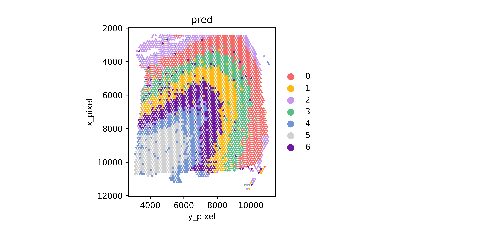
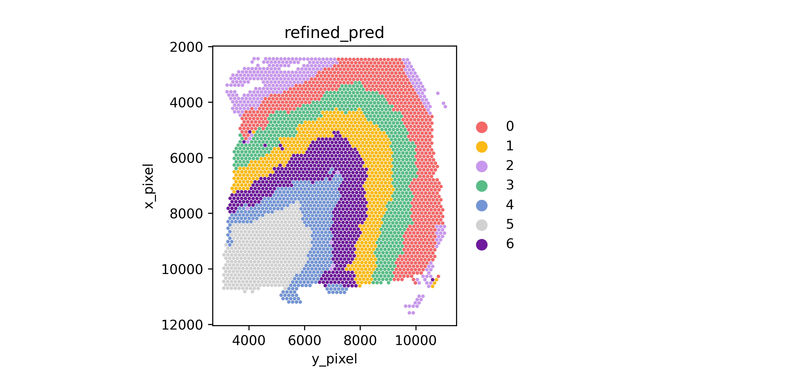
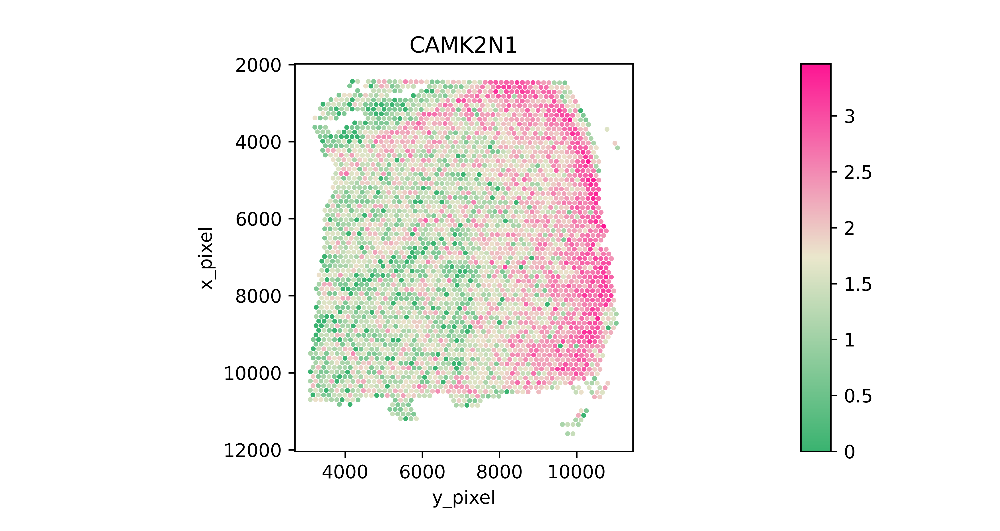
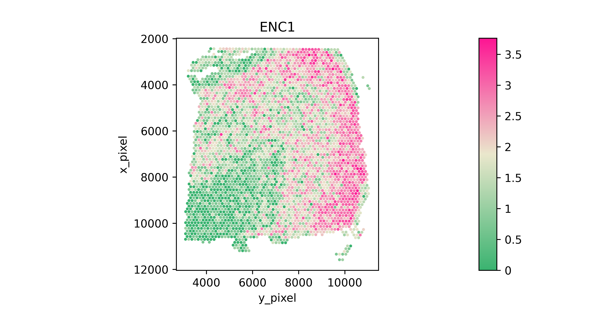
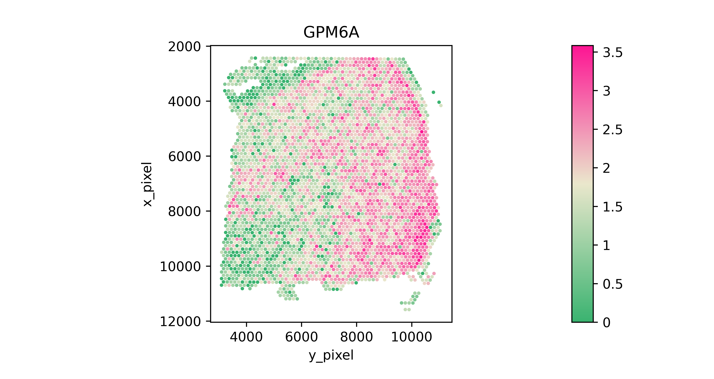
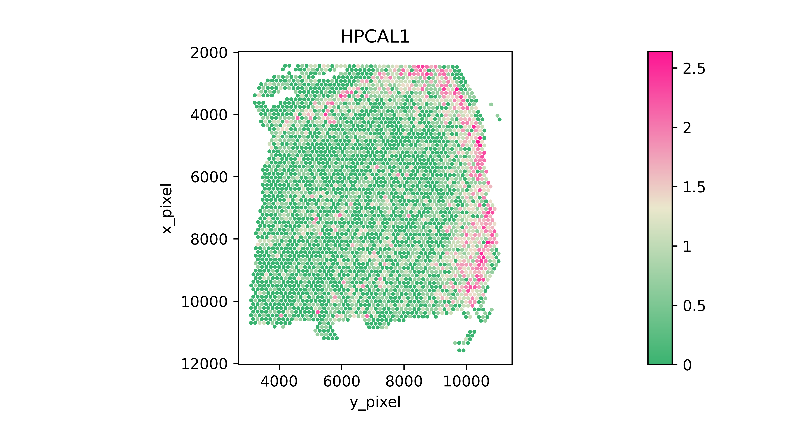
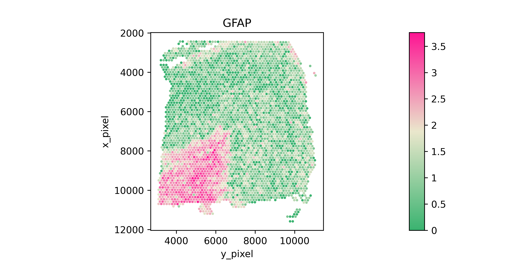
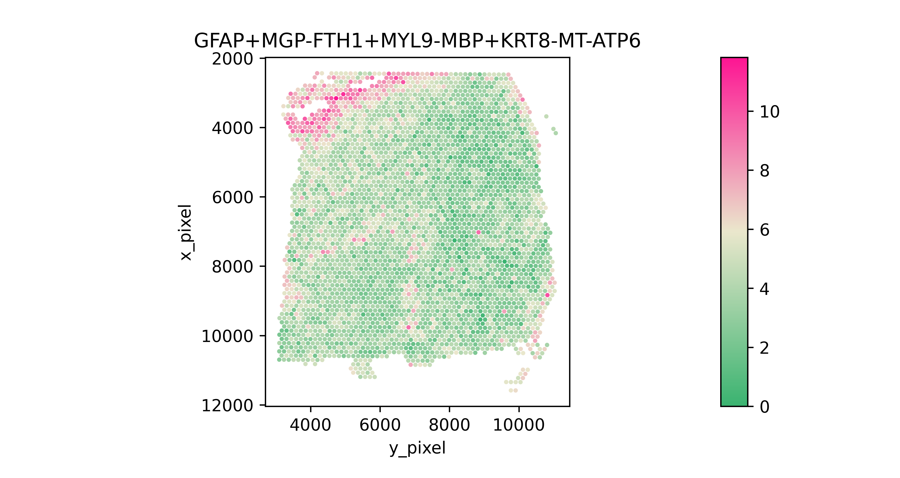

<h1><center>SpaGCN Easy Mode Tutorial</center></h1>


<center>Author: Jian Hu*, Xiangjie Li, Kyle Coleman, Amelia Schroeder, Nan Ma, David J. Irwin, Edward B. Lee, Russell T. Shinohara, Mingyao Li*

## Outline
1. [Installation](https://github.com/jianhuupenn/SpaGCN/blob/master/tutorial/tutorial_ez_mode.md#1-installation)
2. [Import modules](https://github.com/jianhuupenn/SpaGCN/blob/master/tutorial/tutorial_ez_mode.md#2-import-modules)
3. [Read in data](https://github.com/jianhuupenn/SpaGCN/blob/master/tutorial/tutorial_ez_mode.md#3-read-in-data)
4. [Spatial domain detection using SpaGCN](https://github.com/jianhuupenn/SpaGCN/blob/master/tutorial/tutorial_ez_mode.md#4-spatial-domain-detection-using-spagcn)
5. [Identify SVGs](https://github.com/jianhuupenn/SpaGCN/blob/master/tutorial/tutorial_ez_mode.md#5-identify-svgs)
6. [Identify Meta Gene](https://github.com/jianhuupenn/SpaGCN/blob/master/tutorial/tutorial_ez_mode.md#6-identify-meta-gene)
<br>


### 1. Installation
The installation should take a few minutes on a normal computer. To install SpaGCN package you must make sure that your python version is over 3.5. If you don’t know the version of python you can check it by:


```python
import platform
platform.python_version()
```


    '3.8.8'


Note: Because SpaGCN pends on pytorch, you should make sure torch is correctly installed.
<br>
Now you can install the current release of SpaGCN by the following three ways:
#### 1.1 PyPI: Directly install the package from PyPI.


```python
pip3 install SpaGCN
#Note: you need to make sure that the pip is for python3，or you can install SpaGCN by
python3 -m pip install SpaGCN
#If you do not have permission (when you get a permission denied error), you can install SpaGCN by
pip3 install --user SpaGCN
```
#### 1.2 Github
Download the package from Github and install it locally:


```python
git clone https://github.com/jianhuupenn/SpaGCN
cd SpaGCN/SpaGCN_package/
python3 setup.py install --user
```

#### 1.3 Anaconda
If you do not have Python3.5 or Python3.6 installed, consider installing Anaconda. After installing Anaconda, you can create a new environment, for example, SpaGCN (you can change to any name you like).


```python
#create an environment called SpaGCN
conda create -n SpaGCN python=3.7.9
#activate your environment 
conda activate SpaGCN
git clone https://github.com/jianhuupenn/SpaGCN
cd SpaGCN/SpaGCN_package/
python3 setup.py build
python3 setup.py install
conda deactivate
```

### 2. Import modules

```python
import os,csv,re
import pandas as pd
import numpy as np
import scanpy as sc
import math
import SpaGCN as spg
from scipy.sparse import issparse
import random, torch
import warnings
warnings.filterwarnings("ignore")
import matplotlib.colors as clr
import matplotlib.pyplot as plt
import SpaGCN as spg
#In order to read in image data, we need to install some package. Here we recommend package "opencv"
#inatll opencv in python
#!pip3 install opencv-python
import cv2
```


```python
spg.__version__
```
    
    '1.2.0'

### 3. Read in data
The current version of SpaGCN requres three input data.
1. The gene expression matrix(n by k): expression_matrix.h5;
2. Spatial coordinateds of samplespositions.txt;
3. Histology image(optional): histology.tif, can be tif or png or jepg.

The gene expreesion data can be stored as an AnnData object. AnnData stores a data matrix .X together with annotations of observations .obs, variables .var and unstructured annotations .uns. 


```python
"""
#Read original data and save it to h5ad
from scanpy import read_10x_h5
adata = read_10x_h5("../tutorial/data/151673/expression_matrix.h5")
spatial=pd.read_csv("../tutorial/data/151673/positions.txt",sep=",",header=None,na_filter=False,index_col=0) 
adata.obs["x1"]=spatial[1]
adata.obs["x2"]=spatial[2]
adata.obs["x3"]=spatial[3]
adata.obs["x4"]=spatial[4]
adata.obs["x5"]=spatial[5]
#Select captured samples
adata=adata[adata.obs["x1"]==1]
adata.var_names=[i.upper() for i in list(adata.var_names)]
adata.var["genename"]=adata.var.index.astype("str")
adata.write_h5ad("../tutorial/data/151673/sample_data.h5ad")
"""
#Read in gene expression and spatial location
adata=sc.read("../tutorial/data/151673/sample_data.h5ad")
#Read in hitology image
img=cv2.imread("../tutorial/data/151673/histology.tif")
```

### 4. Spatial domain detection using SpaGCN

- s: This parameter determines the weight given to histology when calculating Euclidean distance between every two spots. ‘s = 1’ means that the histology pixel intensity value has the same scale variance as the (x,y) coordinates, whereas higher value of ‘s’ indicates higher scale variance, hence, higher weight to histology, when calculating the Euclidean distance. 

- b: This parameter determines the area of each spot when extracting color intensity.
- n_clusters: Number of spatial domains wanted.
- res: Resolution in the initial Louvain's Clustering methods. If the number of clusters is known, we can use the spg.search_res() fnction to search for suitable resolution(optional)


```python
#Set coordinates
adata.obs["x_array"]=adata.obs["x2"]
adata.obs["y_array"]=adata.obs["x3"]
adata.obs["x_pixel"]=adata.obs["x4"]
adata.obs["y_pixel"]=adata.obs["x5"]
x_array=adata.obs["x_array"].tolist()
y_array=adata.obs["y_array"].tolist()
x_pixel=adata.obs["x_pixel"].tolist()
y_pixel=adata.obs["y_pixel"].tolist()
#Run SpaGCN
adata.obs["pred"]= spg.detect_spatial_domains_ez_mode(adata, img, x_array, y_array, x_pixel, y_pixel, n_clusters=7, histology=True, s=1, b=49, p=0.5, r_seed=100, t_seed=100, n_seed=100)
adata.obs["pred"]=adata.obs["pred"].astype('category')
#Refine domains (optional)
#shape="hexagon" for Visium data, "square" for ST data.
adata.obs["refined_pred"]=spg.spatial_domains_refinement_ez_mode(sample_id=adata.obs.index.tolist(), pred=adata.obs["pred"].tolist(), x_array=x_array, y_array=y_array, shape="hexagon")
adata.obs["refined_pred"]=adata.obs["refined_pred"].astype('category')
```

#### Plot spatial domains


```python
plot_color=["#F56867","#FEB915","#C798EE","#59BE86","#7495D3","#D1D1D1","#6D1A9C","#15821E","#3A84E6","#997273","#787878","#DB4C6C","#9E7A7A","#554236","#AF5F3C","#93796C","#F9BD3F","#DAB370","#877F6C","#268785"]
ax=spg.plot_spatial_domains_ez_mode(adata, domain_name="pred", x_name="y_pixel", y_name="x_pixel", plot_color=plot_color,size=150000/adata.shape[0], show=False, save=True,save_dir="./sample_results/pred.png")
ax=spg.plot_spatial_domains_ez_mode(adata, domain_name="refined_pred", x_name="y_pixel", y_name="x_pixel", plot_color=plot_color,size=150000/adata.shape[0], show=False, save=True,save_dir="./sample_results/refined_pred.png")
```

**Spatial Domains** **Refined Spatial Domains**

### 5. Identify SVGs

- target: Target domain to identify SVGs.
- min_in_group_fraction: Minium in-group expression fraction.
- min_in_out_group_ratio: Miniumn (in-group expression fraction) / (out-group expression fraction).
- min_fold_change: Miniumn (in-group expression) / (out-group expression).
- r: Radius to detect a spot's neighboring spots.target: Target domain to identify SVGs.


```python
target=0
#Read in raw data
adata=sc.read("../tutorial/sample_results/results.h5ad")
raw=sc.read("../tutorial/data/151673/sample_data.h5ad")
#Preprocessing
raw.var_names_make_unique()
raw.obs["pred"]=adata.obs["pred"].astype('category')
raw.obs["x_array"]=raw.obs["x2"]
raw.obs["y_array"]=raw.obs["x3"]
raw.obs["x_pixel"]=raw.obs["x4"]
raw.obs["y_pixel"]=raw.obs["x5"]
raw.X=(raw.X.A if issparse(raw.X) else raw.X)
raw.raw=raw
sc.pp.log1p(raw)
#Set filtering criterials
min_in_group_fraction=0.8
min_in_out_group_ratio=1
min_fold_change=1.5
filtered_info=spg.detect_SVGs_ez_mode(raw, target=0, x_name="x_array", y_name="y_array", domain_name="pred", min_in_group_fraction=min_in_group_fraction, min_in_out_group_ratio=min_in_out_group_ratio, min_fold_change=min_fold_change)
```


```python
filtered_info
```


<div>

<table border="1" class="dataframe">
  <thead>
    <tr style="text-align: right;">
      <th></th>
      <th>genes</th>
      <th>in_group_fraction</th>
      <th>out_group_fraction</th>
      <th>in_out_group_ratio</th>
      <th>in_group_mean_exp</th>
      <th>out_group_mean_exp</th>
      <th>fold_change</th>
      <th>pvals_adj</th>
      <th>target_dmain</th>
      <th>neighbors</th>
    </tr>
  </thead>
  <tbody>
    <tr>
      <th>0</th>
      <td>CAMK2N1</td>
      <td>1.000000</td>
      <td>0.944964</td>
      <td>1.058242</td>
      <td>2.333675</td>
      <td>1.578288</td>
      <td>2.128434</td>
      <td>1.656040e-11</td>
      <td>0</td>
      <td>[3, 2]</td>
    </tr>
    <tr>
      <th>2</th>
      <td>ENC1</td>
      <td>0.998638</td>
      <td>0.941848</td>
      <td>1.060295</td>
      <td>2.457791</td>
      <td>1.696083</td>
      <td>2.141931</td>
      <td>1.552131e-03</td>
      <td>0</td>
      <td>[3, 2]</td>
    </tr>
    <tr>
      <th>4</th>
      <td>GPM6A</td>
      <td>0.997275</td>
      <td>0.922118</td>
      <td>1.081505</td>
      <td>2.224006</td>
      <td>1.561187</td>
      <td>1.940255</td>
      <td>8.602227e-03</td>
      <td>0</td>
      <td>[3, 2]</td>
    </tr>
    <tr>
      <th>6</th>
      <td>ARPP19</td>
      <td>0.982289</td>
      <td>0.853583</td>
      <td>1.150784</td>
      <td>1.889256</td>
      <td>1.272106</td>
      <td>1.853637</td>
      <td>4.823349e-02</td>
      <td>0</td>
      <td>[3, 2]</td>
    </tr>
    <tr>
      <th>1</th>
      <td>HPCAL1</td>
      <td>0.851499</td>
      <td>0.465213</td>
      <td>1.830342</td>
      <td>1.141321</td>
      <td>0.406338</td>
      <td>2.085448</td>
      <td>9.706465e-05</td>
      <td>0</td>
      <td>[3, 2]</td>
    </tr>
  </tbody>
</table>
</div>


#### Plot


```python
color_self = clr.LinearSegmentedColormap.from_list('pink_green', ['#3AB370',"#EAE7CC","#FD1593"], N=256)
spg.plot_SVGs_ez_mode(adata=raw, gene_list=filtered_info["genes"].tolist(), x_name="y_pixel", y_name="x_pixel", plot_color=color_self, size=50, show=False, save=True, save_dir="./sample_results/")
```

**CAMK2N1** **ENC1** **GPM6A** **ARPP19** **HPCAL1**

### 6. Identify Meta Gene

- target: Target domain to detect meta gene.
- start_gene: Gene to satrt with. Candidate start genes can be found by lowering the filtering criterials.


```python
target=2
raw.obs["meta"]=spg.detect_meta_genes_ez_mode(raw, target, x_name="x_array", y_name="y_array", domain_name="pred", start_gene="GFAP", use_raw=False)
```

#### Plot


```python
spg.plot_meta_genes_ez_mode(raw, x_name="y_pixel", y_name="x_pixel", meta_name="meta", plot_color=color_self, size=50, show=False, save=True, save_dir="./")
```

**start** **meta gene**
